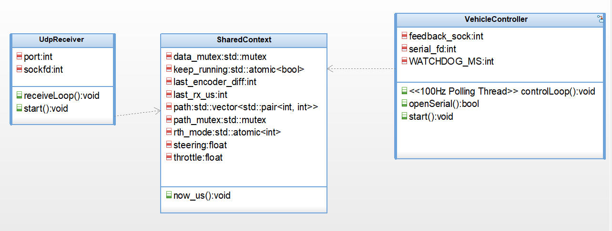

# Neuro-Drive: Distributed UGV Control System (RPi 5 + STM32)


Heterogeneous MPU/MCU distributed control system for an Ackermann-steering UGV.  
The focus is not on "driving an RC car" — it is on **real-time control, communication pipeline design, and fail-safe mechanisms** across two physically separate processors.

> **Portfolio (detailed write-up per phase):** [https://steppenhj.github.io/Neuro-Drive-Portfolio](https://steppenhj.github.io/Neuro-Drive-Portfolio)

---

## Architecture



**MPU (Raspberry Pi 5 / Linux)** — Web UI, WebSocket server, UDP relay, high-level mode management (RTH, Keep-Alive).  
**MCU (STM32F411RE / FreeRTOS)** — UART ISR, RTOS task scheduling, PWM generation, encoder reading, watchdog timer.

### Data Path

```
Browser ──WebSocket──▶ Python (Flask-SocketIO)
                          │
                          ├──UDP (12B: throttle, steering, mode)──▶ C++ Control Core
                          │                                              │
                          │                                         UART (115200)
                          │                                              │
                          │                                              ▼
                          │                                      STM32 (FreeRTOS)
                          │                                        ├─ UART RX ISR → Queue
                          │                                        ├─ Motor Task (PWM)
                          │                                        ├─ Encoder Task (TIM1)
                          │                                        └─ Safety Task (Watchdog)
                          │
                          └──UDP (Encoder telemetry)◀── C++ ◀──UART── STM32
```

---

## Key Features

**Distributed Control** — RPi handles networking and mode logic; STM32 handles hard real-time motor control. Neither can do the other's job.

**FreeRTOS Task Architecture** — UART reception (ISR + Queue), motor control, encoder reading, and safety monitoring run as independent RTOS tasks with mutex-protected shared state.

**Watchdog & Fail-Safe** — If no valid packet arrives within 500ms, the MCU autonomously stops all motors. This operates independently of the RPi.

**Return-to-Home (RTH)** — Encoder-based path recording (LIFO stack) and autonomous reverse traversal. Protocol extended from 8B to 12B to propagate mode across the full stack. Keep-Alive pattern resolves the inherent conflict between watchdog safety and autonomous operation.

**MBSE Documentation** — Use case, object model, sequence, and statechart diagrams created with IBM Rhapsody to formally document system behavior.

---

## Tech Stack

| Layer | Technology |
|-------|-----------|
| Web UI | HTML/CSS/JS, nipplejs (joystick), Socket.IO |
| Server | Python 3.11, Flask-SocketIO, eventlet |
| Control Core | C++17, UDP socket, POSIX threads, mutex |
| Firmware | C (STM32 HAL), FreeRTOS, UART ISR, TIM/PWM |
| Communication | WebSocket, UDP (struct pack), UART (115200 baud) |
| Design | IBM Rhapsody (MBSE), STM32CubeIDE |
| Hardware | Raspberry Pi 5, STM32 Nucleo-F411RE, L298N, Ackermann chassis |

---

## Project Structure

```
Neuro-Drive-CPP/
├── rpi/
│   ├── web/
│   │   ├── app.py                 # Flask-SocketIO server + RTH keep-alive
│   │   └── templates/
│   │       └── index.html         # Control UI (joystick, telemetry, RTH)
│   └── control_core_oop.cpp       # C++ UDP receiver, vehicle controller, RTH logic
│
├── firmware/                      # STM32CubeIDE project
│   └── Core/Src/
│       └── main.c                 # FreeRTOS tasks, UART ISR, PWM, watchdog
│
├── assets/                        # Architecture diagrams (Rhapsody exports)
│   ├── omd_diagram.png
│   ├── sequence_diagram.png
│   ├── statechart_diagram.png
│   └── usecase_diagram.png
│
├── phase_1_code/                  # Legacy: single-board RPi control
├── phase_2_code/                  # UART polling, ASCII protocol
├── phase_3_code/                  # FreeRTOS, ISR, binary protocol
├── phase_4_code/                  # RTH, protocol extension, keep-alive
└── README.md
```

---

## Roadmap

| Phase | Description | Status |
|:-----:|-------------|:------:|
| 1 | Single-board control (RPi + PCA9685, IPC via UDP) | Done |
| 2 | STM32 integration, UART polling, ASCII protocol | Done |
| 3 | FreeRTOS tasks, UART ISR, binary protocol, OOP refactor | Done |
| 4 | Return-to-Home (encoder path stack, protocol extension) | Done |
| 5 | Visual perception — autonomous driving (OpenCV/YOLO) | Planned |
| 6 | OTA firmware update (UART IAP, custom bootloader) | Planned |

---

## Getting Started

### Prerequisites
- Raspberry Pi 5 (Bookworm OS)
- STM32 Nucleo-F411RE + STM32CubeIDE
- Python 3.11+ with `flask-socketio`, `eventlet`

### Run

```bash
# 1. Build and flash STM32 firmware via CubeIDE

# 2. Build C++ control core on RPi
cd rpi/
g++ -o drive_server control_core_oop.cpp -pthread

# 3. Start web server
cd rpi/web/
python3 app.py

# 4. Open browser → http://<rpi-ip>:5000
```

---

## Author

**박해진 (Haejin Park)**  
Computer Engineering, Kyungpook National University  
Targeting embedded SW roles in automotive / defense / semiconductor industries.

---

## License

This project is for portfolio and educational purposes.
