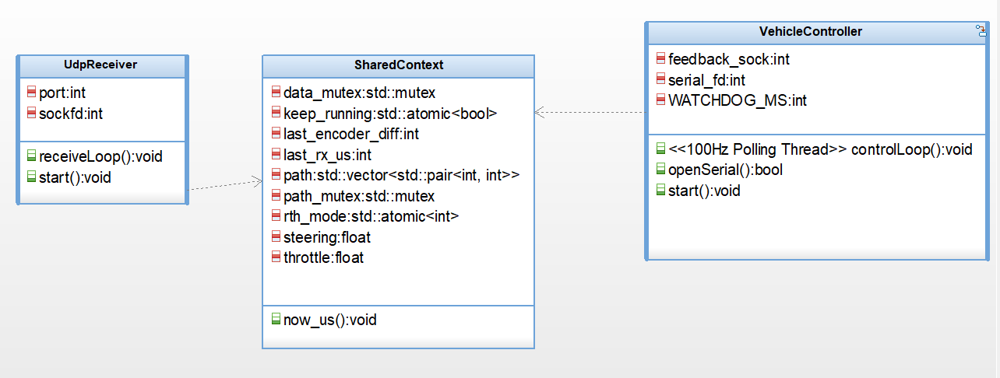
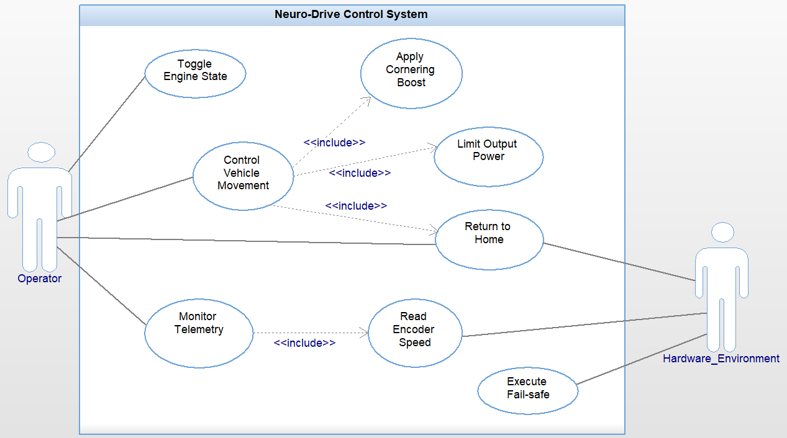
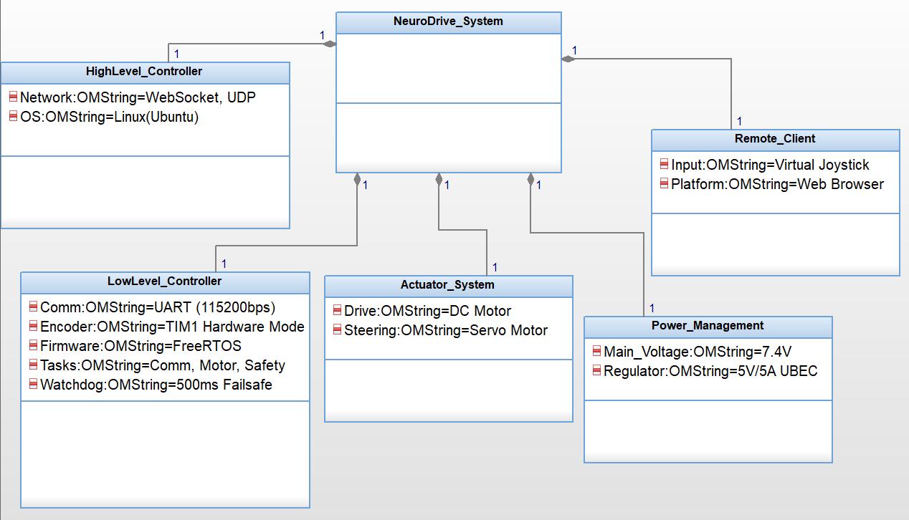
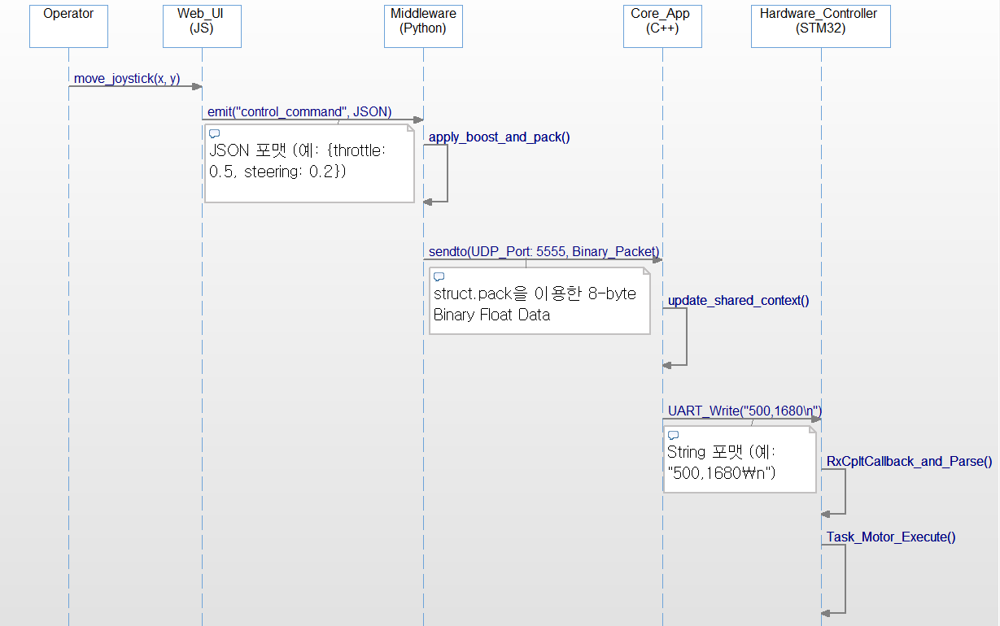
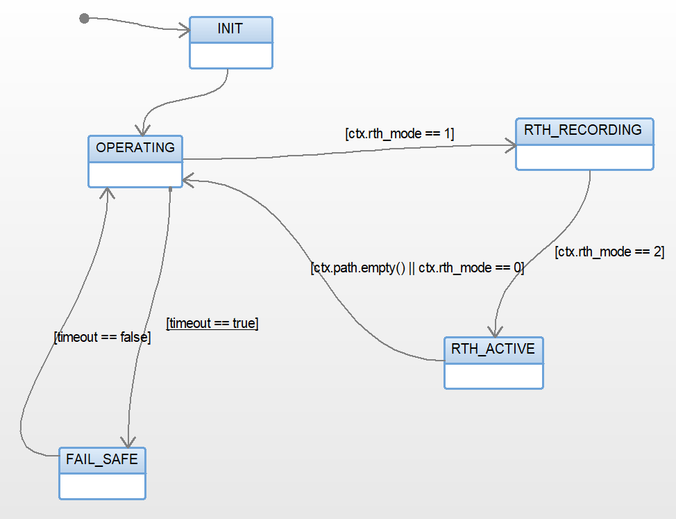
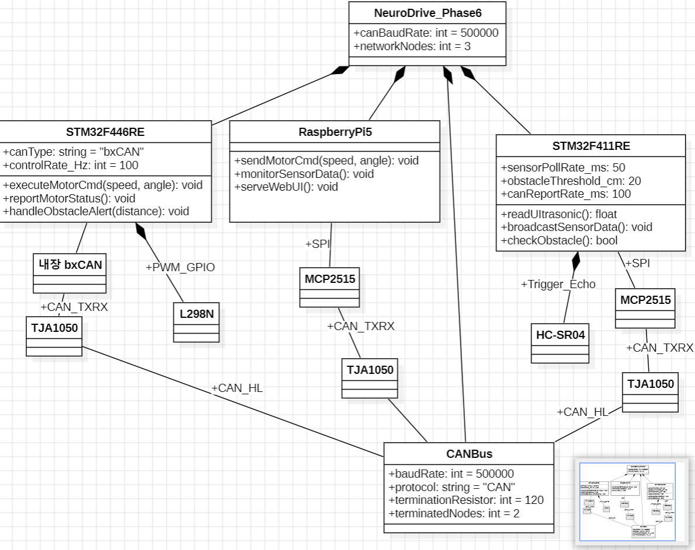
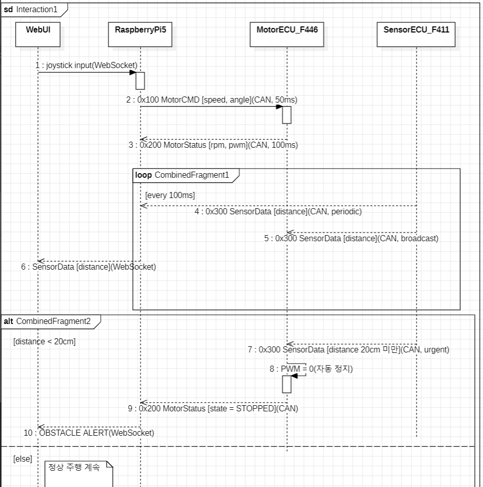

# Neuro-Drive: Distributed UGV Control System (RPi 5 + STM32)

🇰🇷 [한국어](README.kr.md)


Heterogeneous MPU/MCU distributed control system for an Ackermann-steering UGV.  
The focus is on **real-time control, communication pipeline design, and fail-safe mechanisms** across two physically separate processors.

---

## Project Evolution

This project grew through 6 phases, each solving a problem the previous phase exposed.  
The **Turning Point** between Phase 2 and 3 — a hardware failure during field testing — reshaped the entire architecture.  
Click any phase for the detailed write-up.

| Phase | Focus | Key Problem Solved | Status |
|:-----:|-------|--------------------|:------:|
| **1** | [Monolithic Linux Control](https://steppenhj.github.io/#phase1) | Python ↔ C++ IPC on a single RPi board | ✅ Done |
| **2** | [STM32 Distributed Architecture](https://steppenhj.github.io/#phase2) | Linux cannot guarantee hard real-time → split into Brain (RPi) / Reflex (MCU) | ✅ Done |
| ⚠️ | [**Turning Point — In-Operation Failure**](https://steppenhj.github.io/#turning_point) | 7.4V battery line contacted RPi 3.3V GPIO during field test → full architecture pivot | — |
| **3** | [RTOS & Interrupt-Driven Control](https://steppenhj.github.io/#phase3) | Bare-metal polling missed 100Hz deadlines → FreeRTOS + ISR + Queue, 2-DOF PID | ✅ Done |
| **4** | [Return-to-Home Safety System](https://steppenhj.github.io/#phase4) | Watchdog vs. autonomous operation conflict → Keep-Alive pattern, 8B → 12B protocol | ✅ Done |
| **5** | [OTA Firmware Update](https://steppenhj.github.io/#phase5) | Physical reflashing overhead → custom bootloader, CRC handshake, sector management | ✅ Done |
| **6** | [CAN Bus & Multi-ECU](https://steppenhj.github.io/#phase6) | Single UART bottleneck → 3-node CAN 2.0 distributed control | 🟡 In Progress |

---

## Architecture



**MPU (Raspberry Pi 5 / Linux)** — Web UI, WebSocket server, UDP relay, high-level mode management (RTH, Keep-Alive).  
**MCU (STM32F411RE / FreeRTOS)** — UART ISR, RTOS task scheduling, PWM generation, encoder reading, watchdog timer.

### Data Path

```
Browser ──WebSocket──▶ Python (Flask-SocketIO)
                          │
                          ├──UDP (12B: throttle, steering, mode)──▶ C++ Control Core
                          │                                              │
                          │                                         UART (115200)
                          │                                              │
                          │                                              ▼
                          │                                      STM32 (FreeRTOS)
                          │                                        ├─ UART RX ISR → Queue
                          │                                        ├─ Motor Task (PWM)
                          │                                        ├─ Encoder Task (TIM1)
                          │                                        └─ Safety Task (Watchdog)
                          │
                          └──UDP (Encoder telemetry)◀── C++ ◀──UART── STM32
```

---

## MBSE Design Diagrams

Documented with IBM Rhapsody in a consistent model from requirements definition through implementation.

### Use Case Diagram



Defines the primary use cases for operator interaction with the system. `Control Vehicle Movement` includes Cornering Boost, Output Power limiting, and Return-to-Home via `<<include>>`, with the Hardware_Environment participating in Fail-Safe execution.

### Class Diagram (C++ Control Core)



C++ class structure of the Control Core on the RPi side. `SharedContext` owns shared state protected by `std::mutex` and `std::atomic`, referenced by both `UdpReceiver` and `VehicleController`.

### Sequence Diagram (Control Command Flow)



Shows the full-stack data flow from joystick input through Web UI → Python Middleware → C++ Core → STM32. Protocols are converted in order: WebSocket JSON → UDP Binary Packet → UART String.

### Statechart Diagram (RTH & Fail-Safe FSM)



Defines the system's operational states. From `OPERATING`, receiving an RTH command transitions to `RTH_RECORDING` → `RTH_ACTIVE`; a watchdog timeout (`timeout == true`) transitions to `FAIL_SAFE`.

---

## Phase 6 — CAN Bus Diagrams

### Block Diagram (3-Node CAN Architecture)



Three nodes — RPi5 (Gateway), STM32F446RE (MotorECU), STM32F411RE (SensorECU) — are connected over a CAN 2.0 bus via MCP2515 (SPI→CAN) + TJA1050 (transceiver). Eliminates the single UART bottleneck and separates responsibility per node.

### Sequence Diagram (CAN Message Flow & Obstacle Response)



Inter-node communication uses three CAN IDs: `0x100 MotorCMD` (50ms), `0x200 MotorStatus` (100ms), `0x300 SensorData` (100ms, broadcast). When SensorECU detects distance below 20cm, MotorECU autonomously sets PWM to 0 (auto-stop) and propagates the state through Gateway to WebUI.

---

## Demo

### Phase 4 — Return-to-Home

https://github.com/user-attachments/assets/2779ef3e-39d6-4a21-8bef-ed63d195250f

### Phase 5 — OTA Firmware Update

https://github.com/user-attachments/assets/81a38263-ff0c-47a8-944d-1e0a582e165a

---

## Key Features

**Battle-Tested Architecture** — The current design is the result of a critical hardware failure during Phase 2 field testing, when a detached 7.4V battery line contacted the RPi's 3.3V GPIO. The post-incident redesign introduced a deterministic C++ control loop, RTOS-based fail-safe logic, and physical isolation.

**Distributed Control** — RPi handles networking and mode logic; STM32 handles hard real-time motor control. Neither can do the other's job.

**FreeRTOS Task Architecture** — UART reception (ISR + Queue), motor control, encoder reading, and safety monitoring run as independent RTOS tasks with mutex-protected shared state.

**2-DOF Control (Feedback + Feedforward)** — STM32 runs a 100Hz P-controller for disturbance rejection (feedback); Python applies a cornering boost proportional to steering angle (feedforward). Combined output is faster and more stable than single-loop PID.

**Watchdog & Fail-Safe** — If no valid packet arrives within 500ms, the MCU autonomously stops all motors, independent of the RPi.

**Return-to-Home (RTH)** — Encoder-based path recording (LIFO stack) and autonomous reverse traversal. Keep-Alive pattern resolves the inherent conflict between watchdog safety and autonomous operation; protocol extended from 8B to 12B to propagate mode across the full stack.

**OTA Firmware Update** — Custom UART bootloader with handshake protocol, CRC-validated image transfer, sector-level Flash management, and correct bootloader-to-application jump sequence.

**MBSE Documentation** — Use case, object model, sequence, and statechart diagrams created with IBM Rhapsody to formally document system behavior.

---

## Tech Stack

| Layer | Technology |
|-------|-----------|
| Web UI | HTML/CSS/JS, nipplejs (joystick), Socket.IO |
| Server | Python 3.11, Flask-SocketIO, eventlet |
| Control Core | C++17, UDP socket, threads, mutex |
| Firmware | C (STM32 HAL), FreeRTOS, UART ISR, TIM/PWM, custom bootloader |
| Communication | WebSocket, UDP (struct pack), UART (115200 baud), CAN 2.0, SPI |
| Design Tools | IBM Rhapsody \| StarUML (MBSE), STM32CubeIDE |
| Hardware | Raspberry Pi 5, STM32 Nucleo-F411RE, L298N, Ackermann chassis |

---

## Hardware

Full bill of materials: [docs/hardware.md](docs/hardware.md)

| Component | Part |
|-----------|------|
| MPU | Raspberry Pi 5 (4GB) |
| MCU — Main | STM32 NUCLEO-F411RE (SensorECU, Phase 1–5) |
| MCU — Motor | STM32 NUCLEO-F446RE (MotorECU, Phase 6) |
| CAN Interface (RPi5) | MCP2515 + TJA1050 (SPI→CAN) |
| CAN Transceiver (F446RE) | MCP2551 (bxCAN) |
| Obstacle Sensor | HC-SR04P Ultrasonic Sensor |
| Chassis | 5KG Ackermann frame (encoder motors included) |
| Motor Driver | Waveshare I2C Motor Driver HAT / L298N |
| Battery | LiPo 7.4V 2S (B2200N-SP35) + UBEC 5A regulator |

---

## Getting Started

### Prerequisites
- Raspberry Pi 5
- STM32 Nucleo-F411RE + STM32CubeIDE
- Python 3.11

### Run

```bash
# 1. Build and flash STM32 firmware via CubeIDE
#    (Bootloader first, then application image)

# 2. Build C++ control core on RPi
cd rpi/
g++ -o drive_server src/control_core_oop.cpp -pthread

# 3. Start web server
cd rpi/web/
python3 app.py

# 4. Open browser → http://<rpi-ip>:5000
```

### OTA Firmware Update (Phase 5)

```bash
# Flash a new application image over UART without a programmer
cd rpi/web/
python3 ota_flasher.py parkhaejin_car.bin
```

---

## Author

**박해진 (Haejin Park)**  
Kyungpook National University
